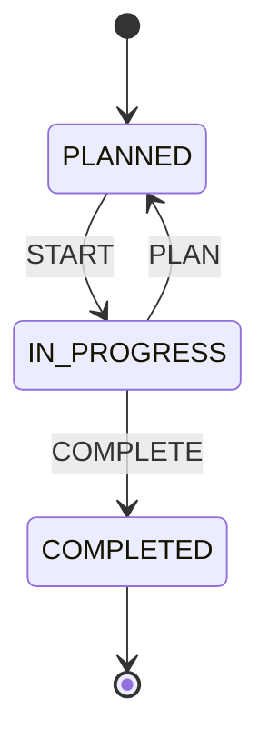
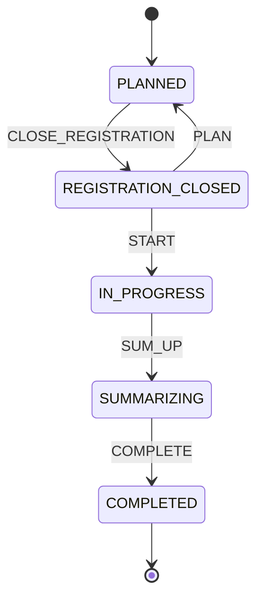
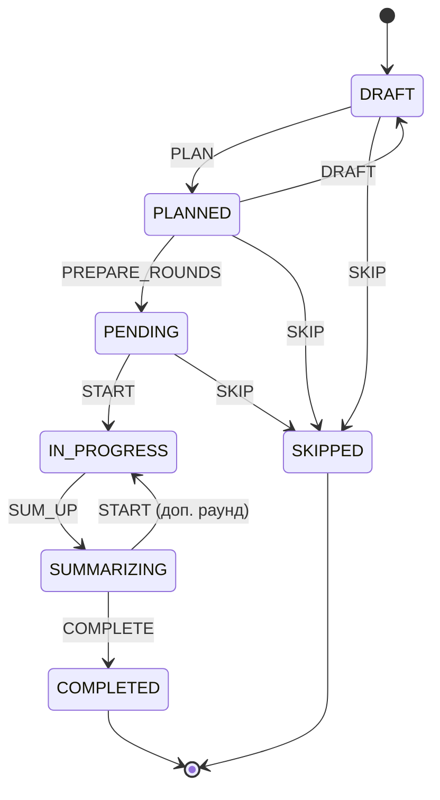
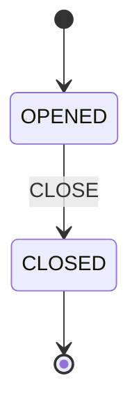

# Диаграмма рабочего процесса системы турниров

## Общая структура иерархии

```
Occasion (Мероприятие)
  └── Activity (Активность)
      └── Milestone (Этап)
          └── Round (Раунд)
```

## State Machine диаграммы

### 1. Occasion (Мероприятие)



**Состояния:**
- PLANNED - Запланировано
- IN_PROGRESS - В процессе
- COMPLETED - Завершено

**События:**
- PLAN - Планирование
- START - Начало
- COMPLETE - Завершение

---

### 2. Activity (Активность)



**Состояния:**
- PLANNED - Запланировано
- REGISTRATION_CLOSED - Регистрация закрыта
- IN_PROGRESS - В процессе
- SUMMARIZING - Подведение итогов
- COMPLETED - Завершено

**События:**
- PLAN - Планирование
- CLOSE_REGISTRATION - Закрыть регистрацию
- START - Начать
- SUM_UP - Подвести итоги
- COMPLETE - Завершить

**Условия:**
- Активность можно создать только если Occasion в состоянии PLANNED или IN_PROGRESS
- Активность нельзя создать если Occasion в состоянии COMPLETED

---

### 3. Milestone (Этап)



**Состояния:**
- DRAFT - Черновик
- PLANNED - Запланировано
- PENDING - Ожидание (раунды подготовлены)
- IN_PROGRESS - В процессе
- SUMMARIZING - Подведение итогов
- COMPLETED - Завершено
- SKIPPED - Пропущено

**События:**
- DRAFT - Вернуть в черновик
- PLAN - Запланировать
- PREPARE_ROUNDS - Подготовить раунды
- START - Начать этап
- SUM_UP - Подвести итоги
- COMPLETE - Завершить
- SKIP - Пропустить

**Условия:**
- Этап можно создать только если Activity в состоянии PLANNED
- Этап нельзя перевести в PLANNED если:
  - Отсутствует MilestoneRule
  - У правила нет критериев
  - Activity в состоянии COMPLETED
- Этап можно пропустить только если он в состоянии DRAFT, PLANNED или PENDING
- При пропуске этапа конкурсанты переносятся в следующий этап

---

### 4. Round (Раунд)



**Состояния:**
- OPENED - Открыт (можно редактировать результаты)
- CLOSED - Закрыт (результаты зафиксированы)

**События:**
- CLOSE - Закрыть раунд

**Условия:**
- Раунд закрывается автоматически при подведении итогов этапа (SUM_UP)
- После закрытия раунд нельзя редактировать

---

## Полный workflow процесса

```mermaid
flowchart TD
    Start([Начало]) --> CreateOccasion[Создать Occasion<br/>PLANNED]
    CreateOccasion --> CreateActivity{Создать Activity<br/>PLANNED}
    
    CreateActivity --> CreateMilestones[Создать Milestones<br/>от финала к отборочному<br/>DRAFT]
    CreateMilestones --> CreateRules[Создать MilestoneRule<br/>и MilestoneCriterion]
    CreateRules --> PlanMilestones[Перевести Milestones<br/>в PLANNED]
    
    PlanMilestones --> CreateParticipants[Создать Participants]
    CreateParticipants --> RegisterParticipants[Зарегистрировать Participants]
    RegisterParticipants --> CloseRegistration[Activity:<br/>CLOSE_REGISTRATION]
    
    CloseRegistration --> CreateContestants[Сформировать Contestants<br/>из зарегистрированных Participants<br/>и привязать к последнему<br/>нескипнутому Milestone]
    
    CreateContestants --> StartActivity[Activity:<br/>START → IN_PROGRESS]
    
    StartActivity --> PrepareRounds[Для каждого Milestone:<br/>PREPARE_ROUNDS → PENDING<br/>Создать Rounds OPENED]
    
    PrepareRounds --> StartMilestone[Для каждого Milestone:<br/>START → IN_PROGRESS]
    
    StartMilestone --> JudgeEvaluation[Судьи оценивают<br/>JudgeMilestoneResult]
    
    JudgeEvaluation --> AllRoundsReady{Все основные<br/>раунды оценены?}
    
    AllRoundsReady -->|Нет| JudgeEvaluation
    AllRoundsReady -->|Да| SumUpMilestone[Milestone:<br/>SUM_UP → SUMMARIZING<br/>Создать MilestoneResult<br/>Rounds → CLOSED]
    
    SumUpMilestone --> NeedExtraRound{Нужен<br/>доп. раунд?}
    
    NeedExtraRound -->|Да| CreateExtraRound[Создать Extra Round<br/>OPENED]
    CreateExtraRound --> ExtraRoundEvaluation[Судьи оценивают<br/>доп. раунд]
    ExtraRoundEvaluation --> RecalculateResults[Пересчитать результаты<br/>Milestone]
    RecalculateResults --> CompleteMilestone
    
    NeedExtraRound -->|Нет| CompleteMilestone[Milestone:<br/>COMPLETE → COMPLETED<br/>Перенести Contestants<br/>в следующий Milestone]
    
    CompleteMilestone --> AllMilestonesCompleted{Все Milestones<br/>COMPLETED?}
    
    AllMilestonesCompleted -->|Нет| StartMilestone
    AllMilestonesCompleted -->|Да| SumUpActivity[Activity:<br/>SUM_UP → SUMMARIZING]
    
    SumUpActivity --> CompleteActivity[Activity:<br/>COMPLETE → COMPLETED]
    
    CompleteActivity --> CompleteOccasion[Occasion:<br/>COMPLETE → COMPLETED]
    
    CompleteOccasion --> End([Конец])
    
    style CreateOccasion fill:#008B8B
    style CreateActivity fill:#008B8B
    style CreateMilestones fill:#DC143C
    style CreateRules fill:#DC143C
    style PlanMilestones fill:#DC143C
    style CreateParticipants fill:#008B8B
    style RegisterParticipants fill:#008B8B
    style CloseRegistration fill:#FF6347
    style CreateContestants fill:#FF6347
    style StartActivity fill:#191970
    style PrepareRounds fill:#191970
    style StartMilestone fill:#191970
    style JudgeEvaluation fill:#2F4F4F
    style SumUpMilestone fill:#2F4F4F
    style CompleteMilestone fill:#DC143C
    style CompleteActivity fill:#2F4F4F
    style CompleteOccasion fill:#2F4F4F
```



## Ключевые моменты процесса

### Фаза подготовки (Setup)
1. **Создание структуры:**
   - Occasion (PLANNED)
   - Activity (PLANNED) - только если Occasion в PLANNED или IN_PROGRESS
   - Milestones (DRAFT) - создаются от финала (порядок 0) к отборочному
   - MilestoneRule и MilestoneCriterion для каждого Milestone

2. **Планирование:**
   - Milestones переводятся в PLANNED (требуется: правило, критерии, Activity не COMPLETED)

3. **Регистрация:**
   - Создание Participants
   - Регистрация Participants (присвоение номеров)
   - Activity: CLOSE_REGISTRATION
   - Автоматическое формирование Contestants из зарегистрированных Participants
   - Привязка Contestants к последнему нескипнутому Milestone

### Фаза проведения (Execution)
1. **Запуск:**
   - Activity: START → IN_PROGRESS
   - Для каждого Milestone: PREPARE_ROUNDS → PENDING (создание Rounds)
   - Для каждого Milestone: START → IN_PROGRESS

2. **Оценивание:**
   - Судьи создают JudgeMilestoneResult для каждого Round
   - Результаты можно редактировать пока Round в состоянии OPENED

3. **Подведение итогов этапа:**
   - Когда все основные раунды оценены: Milestone SUM_UP → SUMMARIZING
   - Автоматическое создание MilestoneResult
   - Все Rounds переводятся в CLOSED (нельзя редактировать)

4. **Дополнительные раунды (опционально):**
   - Если нужен доп. раунд: создается Extra Round (OPENED)
   - Судьи оценивают доп. раунд
   - Результаты пересчитываются
   - Milestone возвращается в IN_PROGRESS для доп. раунда или завершается

5. **Завершение этапа:**
   - Milestone: COMPLETE → COMPLETED
   - Contestants, прошедшие по результатам, переносятся в следующий Milestone

### Фаза завершения (Finalization)
1. **Завершение активности:**
   - Когда все Milestones COMPLETED: Activity SUM_UP → SUMMARIZING
   - Activity: COMPLETE → COMPLETED

2. **Завершение мероприятия:**
   - Occasion: COMPLETE → COMPLETED

## Особые случаи

### Пропуск этапа (SKIP)
- Можно пропустить Milestone в состояниях: DRAFT, PLANNED, PENDING
- При пропуске: Contestants переносятся в следующий Milestone
- Если это финальный этап (порядок 0), Contestants просто переносятся

### Перегенерация раундов
- Можно перегенерировать раунды пока Milestone в состоянии PENDING
- Все существующие раунды удаляются и создаются заново

### Добавление конкурсантов
- Можно добавлять Contestants в Milestone пока он не начат (DRAFT, PLANNED, PENDING)

## Зависимости состояний

```
Occasion:IN_PROGRESS → Activity можно создать/изменить
Activity:PLANNED → Milestone можно создать
Activity:IN_PROGRESS → Milestone можно запустить
Milestone:PENDING → Round можно создать/перегенерировать
Milestone:IN_PROGRESS → Round можно оценивать
Milestone:SUMMARIZING → Round закрывается, можно создать Extra Round
```

